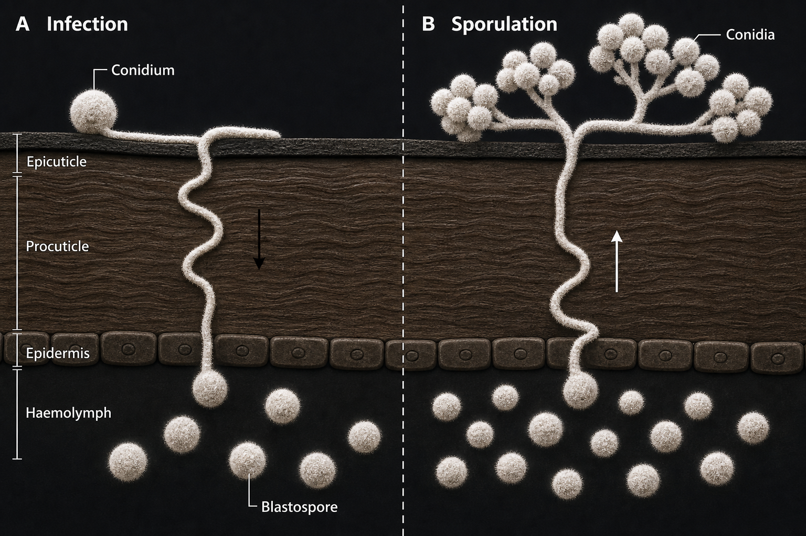

# Beauveria bassiana systematic review

Can a fungus weaken a hornet colony from the inside? This review collects the evidence for using *Beauveria bassiana* (Bb), a naturally occurring insect-killing fungus, against *Vespa velutina* (yellow-legged hornet) delivered by contaminating hornet workers through selective traps and baits.

## The idea story

A *Vespa velutina* enters a selective trap. She drinks sugar bait or takes protein bait carrying *Beauveria bassiana* spores (conidia), or picks them up from the trap surface as she passes. She flies back to the nest. Nestmates pick up spores by contact. The spores grow through the cuticle into the body cavity. That can kill the hornet, alter her behaviour, or be cleared by her immune system. A dead hornet may sporulate and generate new conidia. The ideal outcome is colony collapse; the more realistic target is colony weakening: less damage this season, fewer queens and drones for the next.

## Summary

1. **EU products and NL use.** Six Bb strains hold EU active-substance approval. Whether any product is authorised in the Netherlands for trap or bait delivery is on the to-do list.
2. **Kill or weaken *V. velutina*.** One Bb isolate from a wild foundress killed hornets in the lab (half died in about 6 days); field efficacy on *V. velutina* colonies remains untested.
3. **Selective delivery.** Both passage-contact dispensers and sugar/protein baits load spores onto insects in lab and field trials, but neither has been validated for *V. velutina*.
4. **Horizontal transfer to nestmates.** Social wasps transfer spores by contact; species differ in whether nestmates detect and exclude exposed individuals. The minimum spore load a returning *V. velutina* forager must carry is unknown.
5. **Fungal growth in the nest.** Bb grows best at 23-28 °C with high humidity; nest temperature and humidity of *V. velutina* have yet to be measured.
6. **Colony-level impact.** Bb caused colony failure in *Polistes dominula* in the lab; colony weakening or collapse from catch-infect-release in *V. velutina* is an open question.

**Note:** direct data on *V. velutina* and Bb are scarce. Where hornet data are missing, this review draws on studies of related wasps, bees, beetles, and other insects as proxies, and labels them as such.

## Research questions

1. Which Bb strains are commercially available in the EU, what formulations exist, and what use is allowed in the Netherlands?
2. Can Bb kill or weaken *V. velutina* and non-target species under field conditions, not only in a lab assay?
3. How can Bb be delivered so *V. velutina* picks up spores and carries them (formulation, dispenser design)?
4. Can a treated hornet transfer spores to nestmates, and at what concentrations?
5. Does nest temperature and humidity allow the fungus to grow after transfer?
6. Is the resulting infection strong enough to reduce queen and drone production, or to collapse the colony?

Exact search strings: [search log](results/methods/search-log.md).

## Index

- [Background](#background) · [background](results/background.md)
- [1 EU-available products, strains and formulations](#1-eu-available-products-strains-and-formulations) · [eu-products](results/01-eu-products.md)
- [2 Effect on Vvel, Vespidae, other Hymenoptera, other insects](#2-effect-on-vvel-vespidae-other-hymenoptera-other-insects) · [effects](results/02-effects.md)
- [3 Mechanics and delivery](#3-mechanics-and-delivery) · [mechanics-delivery](results/03-mechanics-delivery.md)
- [4 Horizontal spread in the Vvel nest](#4-horizontal-spread-in-the-vvel-nest) · [horizontal-spread](results/04-horizontal-spread.md)
- [5 Fungal growth on the Vvel](#5-fungal-growth-on-the-vvel) · [fungal-growth](results/05-fungal-growth.md)
- [6 Effect of fungi on Vespidae nests](#6-effect-of-fungi-on-vespidae-nests) · [nest-effects](results/06-nest-effects.md)
- [Study selection](#study-selection)
- [Methods lab journal](results/methods/journal.md) · [search log](results/methods/search-log.md) · [commercial affiliations](results/methods/commercial-affiliations.md)
- [Attachments](results/attachments/README.md) · [phylogenetic tree](results/attachments/phylogenetic-tree.md)

## Background

*Beauveria bassiana* is a soil fungus found worldwide. Infection follows seven steps (Valero-Jimenez2016):

1. The spore sticks to the insect cuticle
2. It germinates and grows into the outer shell
3. Inside, it multiplies as single cells (blastospores) in the blood
4. It colonises the body and eventually kills the host
5. The insect's immune system may fight back, sometimes clearing the infection
6. After death, fungal threads emerge and produce new spores that can infect others

Original diagram based on Valero-Jimenez2016

Efficacy in the field depends on humidity, temperature, UV exposure, and rainfall (Mascarin2016).

Bb has many strains, each with its own killing power, growth speed, and stress tolerance. Even batches of the same commercial product can differ (Moore2026), and laboratory-recultured spores can behave differently from the commercial product (Nouri-Aiin2021).

## 1 EU-available products, strains and formulations

Six Bb strains hold EU active-substance approval under Regulation (EC) No 1107/2009. They are sold as sprays, wettable powders, granules, or electrostatic powder, mostly for protected crops, storage pests, and palm weevils. Whether any product label covers trap or bait-station use is an open question, and EU approval may not automatically mean a product is authorised in the Netherlands. Full strain table and product details: [eu-products](results/01-eu-products.md).

Spray trials with named EU products: BotaniGard ES (strain GHA) cut chilli thrips 48-71% on roses (Aristizabal2017; abstract). Plant dips with BotaniGard gave 81-86% corrected whitefly mortality on mint (Aristizabal2018; abstract). These are conventional crop uses, not trap delivery.

Product quality varies: balEnce germinated poorly where BotaniGard ES and Mycotrol O killed house flies (Weeks2016). Velifer ES and BotaniGard ES killed tea shot-hole borer faster (6-8 d) than wettable-powder products; cadaver sporulation was highest on Velifer ES (Chavez2023; beetle proxy). Even between batches of the same commercial product, ethanol tolerance, pathogenicity, and spore production differed (Moore2026).

## 2 Effect on Vvel, Vespidae, other Hymenoptera, other insects

### 2.1 V. velutina
Direct evidence on *V. velutina* and Bb is limited to one isolate from a single research group:

- A Bb strain was isolated from a naturally infected foundress in Brittany; growth fastest at 20-28 °C, optimum about 20-22.6 °C (Poidatz2019; funded by Bayer Crop Science).
- Lab bioassay of that isolate on adult hornets at about 10⁷ spores/mL: half died in 6.25 ± 0.67 days; direct inoculation gave the highest mortality (Poidatz2018). Application above 20 °C recommended.

Related, not Bb:

- A comparison of *V. velutina*, *Vespula vulgaris*, and *Bombus terrestris* exposed to *Metarhizium robertsii* (not Bb) found hornets consistently the most susceptible, even at low spore concentrations (Lacombrade2025; CIFRE doctoral co-funding with M2i Biocontrol, disclosed in COI section as non-influential).

### 2.2 Vespidae
Bb kills other social wasps in the lab, but results vary by species and life stage:

- *Vespula germanica*: sugar bait at 1 × 10⁸ spores mL⁻¹ killed 79-95% of workers and 66-73% of males (Merino2007; Chilean isolates, outside EU commerce; co-funded via agreement with Controladora de Plagas Forestales S.A., a pest control service company).
- *V. germanica* and *Polistes dominula* larvae: Eco-Bb (R444) killed all tested larvae by day 7. In-nest spray infected 31% of larvae but only 3% of pupae; pupae were largely spared (VanZyl2024).
- *Mischocyttarus metathoracicus*: Boveril (ESALQ PL63), half died by day 19, slower than imidacloprid (DeSouza2023).
- *P. dominula*: Naturalis (ATCC 74040) caused colony failure with brood ejection and reduced foundress reproduction (Cappa2024; topical dose 1 μL of 10⁶ spores/μL).

*Polistes* and *Mischocyttarus* build open-comb nests where brood is directly exposed. *V. velutina* nests are enclosed in a paper envelope, so spores must travel through returning workers rather than landing directly on brood.

Photo: Root Simple, CC BY-NC

### 2.3 Other Hymenoptera
Studies framed as safety tests tend to report little Bb effect on bees (Zimmermann2007; Omuse2022; Meikle2008, USDA-ARS, GHA material supplied by S.T. Jaronski of Mycotech Corp.); studies aimed at controlling those same taxa or testing direct pathogenicity report high mortality (Portilla2017; Leite2022) and sublethal disruption of nestmate recognition and cognition (Cappa2019; Carlesso2020). Leite2022 explicitly flags this tension: hive-level varroa studies found no colony damage while individual-level lab assays on the same fungus found considerable mortalities. Both framings appear in the literature, and that asymmetry matters for interpreting bee risk.

Honey bee contact mortality with ICIPE 284 reached at most 17.4% under hive-simulated conditions; stingless bee *Meliponula ferruginea* reached at most 11.0% (Omuse2022). Lab contact and ingestion of commercial Bb reduced survival of *Apis mellifera* and *Bombus terrestris* at the individual level; oral exposure can exceed topical (Leite2022). Isolate NI8 killed 98.2% of honey bees at the highest lab concentration at 10 d (Portilla2017). Hive-mounted bumblebee dispensers put detectable Bb on 97-99% of *Bombus impatiens* workers with no epizootic and no adverse colony impact (Al-Mazraawi2006; Bb provided by Emerald BioAgriculture, the predecessor to Laverlam/BotaniGard).

Apple sawfly (*Hoplocampa testudinea*): soil-applied BotaniGard GHA gave 49-68% lab mycosis but only 17% in field soil cages (Swiergiel2016; hymenopteran soil proxy).

### 2.4 Other insects
High spray or contact mortality is common in aphids, whiteflies, beetles, flies, thrips, and moths (Wraight2010, USDA-ARS, but co-author S.T. Jaronski was affiliated with Mycotech Corp., a Bb product company and predecessor to the Laverlam/BioWorks BotaniGard line; Parker2015, Univ. of Vermont, no manufacturer funding; proxies). Autodissemination (insects spreading spores to each other) is demonstrated in sap beetles, kissing bugs, and bed bugs (Dowd2003, USDA-ARS; Forlani2011, CONICET-UNLP, no conflicts; Barbarin2012, Penn State). Field failure also occurs: three Bb applications did not reduce spotted lanternfly numbers (Keller2023, Penn State, funded by PA Dept of Agriculture and USDA APHIS/NIFA; co-author Nina Jenkins is lead author of US Patent 14/810,137 (Aprehend, a Bb bed bug biopesticide) and co-founder of ConidioTec LLC, the company producing it, disclosed in the paper's acknowledgements).

## 3 Mechanics and delivery

Two pickup modes sit side by side: contact on a passage surface (1- or 2-way dispenser) and spores mixed into sugar or protein bait. Both work for pollinators; neither is established as the better option for Vespidae.

Hive-mounted 1- and 2-way dispensers move Bb onto crops via bumblebees (Al-Mazraawi2006; Kapongo2025). Maize flour carried more spores through bee dispensers than coarser meals (Al-Mazraawi2007; Bb provided by Emerald BioAgriculture). NZ protein baits with *Metarhizium* and Bb reduced *Vespula* nest traffic; infected larvae were recovered from both fungal treatments (Brownbridge2009). Red-palm-weevil pheromone traps with Broadband gave half dead by day 4 at 10⁸ spores/mL (Hajjar2015; weevil proxy).

Oil formulations improve infection at low humidity, extend thermal stress tolerance, and protect against UV (Mascarin2016). HEC and alginate hydrogels kept Bb viable up to 24 d in a mosquito ovitrap assay (Friuli2025). Carnauba wax in dry powder raised virulence in a blowfly assay (Muniz2020). Corn-oil coating improved granular thermotolerance (Kim2010). Longifolene at 0.2-0.4 mmol mL⁻¹ reversed spore repellence in a termite bait (Lin2026).

UV is a field constraint. After simulated sunlight, spores showed a half-life of about 2 hours (Zimmermann2007). An archaeal photolyase transgene raised spore survival after 4-7 h natural sunlight up to 44-fold and preserved virulence on *Anopheles gambiae* (Fang2012; engineered mosquito proxy).

## 4 Horizontal spread in the Vvel nest

Catch-treat-release with fipronil demonstrates the social-wasp design pattern (Buczkowski2024; not Bb). Protein bait with 0.01% fipronil reduced *V. velutina* pressure at apiaries for at least two weeks in one trial (Barandika2023; not Bb; co-authors R. Fananas and E. Arroyo are employees of D+S-OABE, which partially funded the study, disclosed in the COI section).

Nestmate response to Bb-exposed social wasps varies by species:

- *Mischocyttarus metathoracicus*: cuticular hydrocarbon (CHC) profiles similar 24 h after Boveril exposure; nestmates did not discriminate exposed from unexposed individuals (DeSouza2023).
- *Polistes dominula*: Bb altered CHC profiles and increased aggression toward exposed nestmates, interpreted as exclusion of infected individuals from the nest (DeFazi2025).
- Stingless bees: *Tetragonisca* guards exclude pathogen-exposed nestmates (Almeida2022ao; proxy).
- Ants: susceptibility and autogrooming vary; concentrations about six orders of magnitude above natural levels did not give 100% mortality (Bos2019).

Santos2026 found bee pathogens in all sampled *V. velutina* stages, supporting a shared nest compartment. The required load (spores per returning forager) for introducing Bb into a *V. velutina* nest remains an open question.

## 5 Fungal growth on the Vvel

Germination on the cuticle and sporulation after death both require high moisture (Zimmermann2007). Optimum temperature for Bb is about 23-28 °C; isolate-dependent minimum is about 5-10 °C, maximum about 30-38 °C (Zimmermann2007). The Poidatz foundress isolate was better adapted to intermediate temperatures (Poidatz2019). Fu2026 isolate WZS5 (melon fly proxy) remained active at 35 °C with half dead by day 5 at 1.0 × 10⁸ spores mL⁻¹.

In honey-bee hives, in-hive temperature near 35 °C abolished germination of formulated spores while forager mortality was high at 25 °C (Peng2020ao; honey-bee nest climate, not *V. velutina*). Nest temperature and relative humidity of *V. velutina* are an open question. Nest paper of *P. dominula* is hydrophobic (VanZyl2024).

## 6 Effect of fungi on Vespidae nests

Colonies remove sick individuals, isolate the dead, and can compensate with more brood; capped cells may shelter pupae (Rose1999). A contaminated returning forager alone is insufficient for nest collapse.

Documented colony-level Bb outcomes in social wasps:

- *P. dominula* in lab/colony boxes: colony failure after topical Naturalis, with brood ejection and reduced foundress reproduction (Cappa2024).
- *M. metathoracicus*: half died by day 19 with no avoidance behaviour; the authors flag a possible threat to colony survival (DeSouza2023).
- *P. dominula* / *V. germanica* field nests: inundative spray, fungal mixture performed better than Bb alone, pupae largely spared (VanZyl2024).
- *P. chinensis*: oral *Beauveria malawiensis* at 2.68 × 10⁶ cfu mL⁻¹ raised adult mortality across three treatment nests (Reason2022).

## Where things stand

The catch-infect-release idea: traps and baits can load spores onto insects, social wasps pass them to nestmates, and Bb can kill wasps and damage colonies in the lab. Each link in the chain has at least some evidence from related species.

The chain has gaps specific to *V. velutina*: field efficacy is untested, the minimum spore load for nest introduction is unknown, nest temperature and humidity have yet to be measured, and the question of whether a commercial EU strain works or a Vespidae-isolated strain is needed remains open. Oil formulation, UV protection, and application temperature all constrain reliability.

For our project, this means: the biology is promising enough to warrant field trials, but there is no ready-to-use product or validated method for *V. velutina* today.

## Study selection

| Stage | n |
|---|---:|
| Records identified | 16,748 |
| Duplicate records removed | 10,498 |
| Unique records | 6,250 |
| Unique records in English | 5,741 |
| Phase 1: title/abstract screened | 6,250 |
| Phase 1: excluded | 5,996 |
| Phase 2: full text sought | 254 |
| Phase 2: excluded | 48 |
| Studies included | 208 |
| PDFs on disk | 114 |
| Includes with matched PDF | 89 |
| Includes without PDF | 119 |
